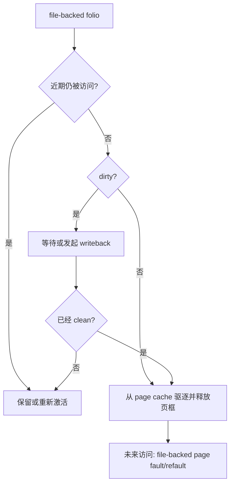
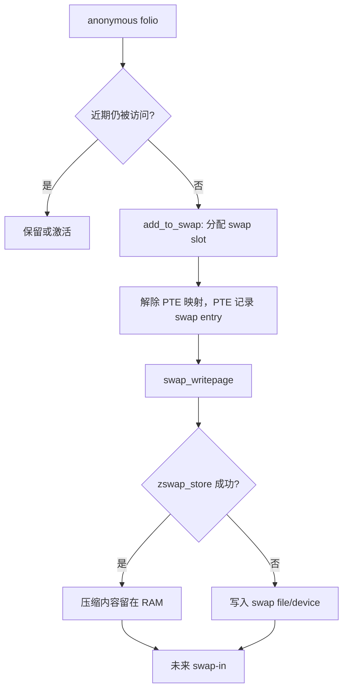
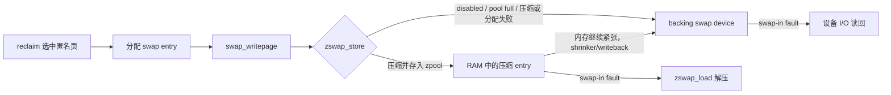

# Linux 内存压力原理：从页面回收到 PSI、zswap 与 OOM

内存使用率高不一定意味着系统有问题。只要工作集能够留在内存中、分配不被阻塞、被淘汰的页不会很快再次访问，Linux 完全可以把空闲内存用于缓存。真正需要警惕的是：**为了满足新的内存分配，内核开始反复扫描、回收、回写和换入页面，并让任务失去有效执行时间。**

本文沿一条因果链解释 Linux 内存压力：

```text
可用页减少
    │
    ├─ 后台回收：唤醒 kswapd
    │
    └─ 分配仍失败：当前任务进入 direct reclaim
             │
             ├─ 冷 file page：丢弃；dirty 时先回写
             └─ 冷 anonymous page：分配 swap slot 并换出
                                      │
                                      ├─ zswap 压缩成功：暂存 RAM
                                      └─ 未命中/被驱逐：写入 swap 设备

回收或 refault 让任务停顿
    └─ PSI 统计停顿造成的时间损失

反复回收却无法恢复可用内存
    └─ allocation retry → OOM killer
```

**一句话总结**：reclaim 是动作，swap/zswap 是匿名页的后备路径，PSI 是压力造成的 stall 时间，OOM 是回收无法继续取得进展后的最后手段；它们不是四套互不相关的功能。

---

## 1. 版本基线与阅读边界

本文源码主线固定为 [Linux v6.12](https://github.com/torvalds/linux/tree/adc218676eef25575469234709c2d87185ca223a)，对应提交：

```text
adc218676eef25575469234709c2d87185ca223a
```

选择 LTS tag 而不是 `master`，是为了让函数位置和结论能够长期复查。内核配置、发行版补丁和后续版本会改变默认值或可用接口，因此文中区分：

- **稳定语义**：例如 file page 与 anonymous page 的后备来源不同、PSI 统计 stall；
- **v6.12 实现**：例如具体函数、分支和 zswap 参数默认值；
- **可选接口**：只有编译选项和挂载条件满足时才出现的 sysfs/debugfs 文件。

本文聚焦 Linux 页级机制，不展开应用对象缓存、业务 DRAM/SSD 分层、cgroup 调参方法论。cgroup v2 只作为“同一机制的局部统计边界”简要出现。

> 命令已按 Linux v6.12 源码和官方 ABI 文档核对；当前写作环境不是 Linux，因此示例应在目标 Linux 机器上执行。不要把示例中的输出数字当成固定值。

---

## 2. 先分清 Linux 在管理什么

Linux 回收的基本对象已经从单个 `struct page` 逐步抽象为 `folio`，但理解时仍可把它看成“一页或一组连续页”。决定回收路径的第一件事不是冷热，而是**内容能否从别处重新得到**。

| 内存类型 | 内容来源 | 回收前是否需要保存 | 常见回收路径 |
| --- | --- | --- | --- |
| clean file-backed page | 文件 | 不需要 | 丢弃映射，之后从文件重读 |
| dirty file-backed page | 文件，但内存有新内容 | 需要 | writeback 后才能丢弃 |
| anonymous page | 进程堆、栈、匿名 `mmap` | 通常需要 | 写入 swap，或进程退出后释放 |
| tmpfs/shmem | 文件接口，底层为 swap-backed 内存 | 需要 | 可走 swap 路径 |
| unevictable/mlocked page | 不能正常驱逐 | — | 跳过回收 |
| reclaimable slab | 内核对象缓存 | 视 shrinker 而定 | 对应 shrinker 回收 |

### 2.1 为什么 clean file page 最容易回收

clean page cache 的内容已经存在于文件中。内核可以删除页表映射和 page cache folio，未来访问时再通过 page fault 从文件读取。这里付出的代价是未来 I/O，不是数据丢失。

### 2.2 为什么 anonymous page 需要 swap

匿名页没有文件作为天然后备副本。若进程仍需保留其内容，内核必须先给它分配 swap entry，把数据保存到某个后备位置，然后才能回收 DRAM 页框。没有可用 swap 时，这部分匿名内存不能通过普通 swap-out 释放。

### 2.3 `free` 少为什么不等于有压力

Linux 主动利用空闲 RAM 做 page cache。比 `MemFree` 更有意义的是 `MemAvailable`：它估算在不发生 swapping 的前提下还能提供多少内存，计算时会考虑 free page、file LRU、可回收 slab 和 zone low watermark。

```bash
grep -E '^(MemTotal|MemFree|MemAvailable|Cached|AnonPages|Inactive\(anon\)|Inactive\(file\)|Dirty|Writeback|SwapTotal|SwapFree|Zswap|Zswapped):' /proc/meminfo
```

关键字段：

| 字段 | 含义 | 不应如何解读 |
| --- | --- | --- |
| `MemFree` | 当前完全空闲的 RAM | 不能单独作为内存健康度 |
| `MemAvailable` | 无需 swap 时可供新负载使用的估计值 | 不是硬保证 |
| `Cached` | 文件 cache，包含 tmpfs/shmem，不含 `SwapCached` | 不等于全部可立即释放 |
| `AnonPages` | 用户页表映射的非文件页 | 不等于全部可换出 |
| `Dirty` / `Writeback` | 等待/正在回写的内存 | 高值可能让回收受 I/O 限制 |
| `SwapCached` | 已换入但 swap 中仍保留副本的页面 | 不是 zswap 压缩池大小 |
| `Zswap` | zswap backend 实际占用的压缩内存 | 不是原始页大小 |
| `Zswapped` | zswap 中保存的原始匿名内存量 | 不等于磁盘 swap 使用量 |

---

## 3. 什么时候开始回收：watermark 与分配慢路径

物理内存按 NUMA node 和 zone 管理。每个 zone 有一组水位，大致可以这样理解：

```text
free pages 高

    high  ───── kswapd 通常回收到这里后休眠
    low   ───── 低于附近时唤醒 kswapd，开始后台回收
    min   ───── 更紧急的保留边界；普通分配越来越难成功

free pages 低
```

这不是一个全机剩余内存百分比。分配是否成功还受 zone、NUMA policy、GFP mask、order、保留页和碎片影响；系统看似仍有内存，也可能因目标 zone 或高阶连续页不足而进入慢路径。

### 3.1 kswapd：后台回收

每个 NUMA node 有 kswapd。它在后台扫描内存，目标是提前恢复水位，尽量避免业务分配线程亲自做回收。

### 3.2 direct reclaim：分配线程自己回收

如果快速分配失败，且调用者允许 `__GFP_DIRECT_RECLAIM`，当前线程会同步进入回收。对在线服务而言，这往往比“内存用了多少”更接近延迟问题，因为业务线程正在做本不属于其业务逻辑的页面扫描、unmap、回写或等待。

### 3.3 源码入口：`__alloc_pages_slowpath()`

v6.12 的 [`mm/page_alloc.c::__alloc_pages_slowpath()`](https://github.com/torvalds/linux/blob/adc218676eef25575469234709c2d87185ca223a/mm/page_alloc.c#L4204-L4455) 可以裁剪为：

```c
// 教学化伪代码，保留真实调用顺序
if (can_wake_kswapd)
    wake_all_kswapds(...);

page = get_page_from_freelist(...);
if (page)
    return page;

if (can_direct_reclaim)
    page = __alloc_pages_direct_reclaim(...);

if (!page && can_compact)
    page = __alloc_pages_direct_compact(...);

if (!page && should_retry)
    goto retry;

if (!page)
    page = __alloc_pages_may_oom(...);
```

这里要区分 reclaim 和 compaction：

- reclaim 释放页，解决“可用页数量不足”；
- compaction 迁移页面、整理连续空间，解决“空闲页不少但不连续”；
- 高阶分配可能在内存总量尚可时仍因碎片进入 compaction。

direct reclaim 在 [`__alloc_pages_direct_reclaim()`](https://github.com/torvalds/linux/blob/adc218676eef25575469234709c2d87185ca223a/mm/page_alloc.c#L3938-L3970) 周围被 `psi_memstall_enter()` / `leave()` 包住，稍后会看到这正是 PSI memory 的一个数据来源。

```text
__alloc_pages_slowpath()
  -> __alloc_pages_direct_reclaim()
       -> __perform_reclaim()
            -> try_to_free_pages()
                 -> do_try_to_free_pages()
                      -> shrink_zones()
                           -> shrink_node()
                                -> MGLRU 或传统 lruvec 扫描
                                     -> shrink_folio_list()
```

`try_to_free_pages()` 构造 `scan_control`，记录目标回收量、GFP 能力、扫描优先级以及是否允许 writepage、unmap、swap；`do_try_to_free_pages()` 再逐步降低 priority、扩大扫描范围，直到达到目标、为 compaction 腾出条件，或确认回收没有进展。

### 3.4 查看 zone 水位

```bash
grep -E '^(Node [0-9]+, zone|[[:space:]]+pages free|[[:space:]]+min|[[:space:]]+low|[[:space:]]+high)' /proc/zoneinfo
```

注意：

- `pages free`、`min`、`low`、`high` 的单位是页，不是 KiB；
- 要乘 base page size 才是字节；
- 水位是 per-zone 的，不能把某个 zone 的 `free < low` 直接解释成全机 OOM；
- `vm.min_free_kbytes` 参与计算各 lowmem zone 的 `WMARK_MIN`，不应随意调小；
- `vm.watermark_scale_factor` 控制水位间距和 kswapd 的激进程度。

```bash
sysctl vm.min_free_kbytes
sysctl vm.watermark_scale_factor
```

官方文档给出的诊断信号是：如果线程频繁进入 direct reclaim（`allocstall` 高速增长），或 kswapd 经常过早睡眠后又被唤醒，可以怀疑后台维持的 free pages 不足以覆盖分配突发；但调整水位前必须先确认工作集和回收效率。

---

## 4. 内核如何选择冷页：LRU、refault 与 MGLRU

### 4.1 传统 LRU 不是精确的时间排序

传统实现把 anonymous/file folio 分开，并各自维护 active/inactive 集合：

```text
                 accessed
inactive list ─────────────> active list
      │                          │
      │ reclaim candidate       │ aging / deactivate
      v                          v
   reclaim <──────────────── inactive
```

页表 accessed/young bit、folio referenced flag 和扫描反馈用于近似判断近期是否访问。它不是每次访问都移动节点的严格 LRU，否则锁和链表操作成本会很高。

在 [`shrink_folio_list()`](https://github.com/torvalds/linux/blob/adc218676eef25575469234709c2d87185ca223a/mm/vmscan.c#L1042-L1597) 中，`folio_check_references()` 的结果可以让页面重新 activate、保留，或继续进入回收路径。

### 4.2 eviction 后为什么还要记住“幽灵”

如果刚被回收的 file page 很快再次 fault，说明内核淘汰了工作集。Linux 在 page cache 的 xarray 中留下 shadow entry，记录 eviction 时刻；refault 时计算：

```text
refault_distance = 当前 nonresident_age - eviction_age
```

若 refault distance 小于可竞争的 working set 大小，页面被认为仍属工作集，可直接激活。v6.12 的 [`workingset_test_recent()`](https://github.com/torvalds/linux/blob/adc218676eef25575469234709c2d87185ca223a/mm/workingset.c#L407-L527) 核心判断就是：

```c
return refault_distance <= workingset_size;
```

因此 `workingset_refault_file` 快速增长不是普通 cache miss 的同义词；它说明“最近被驱逐的页又回来了”，是 cache thrashing 的重要证据。

### 4.3 MGLRU：在现有 LRU 基础上用多个代际表达冷热

传统路径主要依靠 active/inactive 二分做 aging；Multi-Gen LRU 则在 `lruvec` 中增加 generation 序号、代际桶和访问反馈，用多个逻辑代际表达冷热：

```text
max_seq：最新、最热 generation
   ...
min_seq：最老、优先回收 generation
```

aging 阶段通过页表遍历、young bit 和 rmap 反馈发现访问；eviction 阶段从最老 generation 选择 folio。v6.12 的 [`lru_gen_look_around()`](https://github.com/torvalds/linux/blob/adc218676eef25575469234709c2d87185ca223a/mm/vmscan.c#L4037-L4149) 会批量观察相邻 PTE 的 young bit，把热页更新到新 generation。

这里的 generation 是 MGLRU 的逻辑冷热层次，不能理解成它把内核所有 active/inactive 链表和 `lruvec` 数据结构整体替换掉。v6.12 中两条回收路径仍共享 folio flags、isolation、`shrink_folio_list()` 和最终的 writeback/swap/free 逻辑；`shrink_node()` 根据 `lru_gen_enabled()` 选择 MGLRU 或传统扫描入口。

MGLRU 改善的是 reclaim 的冷热判别和扫描效率，不会改变两条基本事实：

- clean file page 可以丢弃；
- anonymous page 若要保留内容，仍需要 swap 后备。

检查 MGLRU 是否启用：

```bash
cat /sys/kernel/mm/lru_gen/enabled
```

前置条件：内核启用 `CONFIG_LRU_GEN=y`。例如 `0x0007` 表示主开关以及受硬件支持的两个 accessed-bit 优化全部打开。接口不存在时，不代表系统没有页面回收，只表示没有这个 MGLRU ABI。

debugfs 已挂载时，可以查看 generation 直方图：

```bash
sudo cat /sys/kernel/debug/lru_gen
```

输出按 memcg 和 NUMA node 展示 generation、年龄、anon pages 和 file pages。该接口更适合调试/实验，不应作为所有发行版稳定存在的业务监控依赖。

---

## 5. reclaim 最终如何处理页面

[`mm/vmscan.c::shrink_folio_list()`](https://github.com/torvalds/linux/blob/adc218676eef25575469234709c2d87185ca223a/mm/vmscan.c#L1042-L1597) 是理解最终处置的关键。省略锁、THP、NUMA demotion、private buffer 等分支后，主线如下：

```c
references = folio_check_references(folio, sc);
if (references says hot)
    activate_or_keep(folio);

if (folio is anonymous && swap-backed && not in swap cache) {
    if (!add_to_swap(folio))
        keep_or_split(folio);
}

if (folio is mapped)
    try_to_unmap(folio);

if (folio is dirty) {
    if (!allowed_to_write_now)
        keep(folio);
    pageout(folio);
}

if (mapping can release folio)
    free(folio);
```

### 5.1 file-backed 路径



dirty file page 不一定由当前 direct reclaimer 立即写回。源码刻意限制单页低效 I/O；很多情况下先标记 reclaim、交给后台 writeback，再在后续扫描中回收。于是存储延迟和 dirty/writeback 堵塞可能间接放大内存压力。

### 5.2 anonymous 路径



没有 swap 时，内核仍可回收 file cache 和其他 reclaimable 对象，但无法通过常规换出释放仍需保留的匿名页。这会缩小可回收范围，不代表“关闭 swap 就不会发生 reclaim”。

---

## 6. swap：匿名页的后备存储协议

swap 不只是“一个磁盘分区”。从内核语义看，它提供 swap entry：`swap type + offset` 标识匿名页的后备位置。PTE 不再指向 present page 时，可以编码这个 entry；未来 fault 再从对应 slot 恢复内容。

```text
present PTE -> physical folio

swap-out:
  allocate swap slot
  copy/write content
  PTE -> swap entry
  free physical folio

swap-in fault:
  allocate folio
  read swap entry
  restore PTE
```

查看当前后备设备：

```bash
swapon --show --bytes
cat /proc/swaps
```

`swapon --show` 更适合人读，可展示类型、大小、已用量和优先级。没有 active swap 时，zswap 也没有可供映射的正常 swap slot，不能把它当成独立的匿名页仓库。

### 6.1 `vm.swappiness` 不是“开始 swap 的内存百分比”

```bash
sysctl vm.swappiness
```

在 v6.12 文档中，它表示 swap I/O 与 filesystem paging 的**相对成本权重**，范围 `0..200`：

- `100`：认为二者 I/O 成本相同；
- 小于 `100`：认为 swap 更贵，倾向回收 file page；
- 大于 `100`：认为 swap 更便宜；使用 zram/zswap 等内存压缩路径时可能合理；
- `0`：不是完全禁止 swap。官方文档的精确条件是：直到某个 zone 的 **free pages 与 file-backed pages 之和**低于该 zone 的 high watermark，内核才会主动发起 swap。

最优值依赖工作集和后端 I/O，不能从“数据库/在线服务”标签直接推出。

---

## 7. zswap：swap 写盘前的压缩缓存

### 7.1 它在数据路径中的准确位置

zswap 不是新的页冷热算法，也不是 block device。它在 swap I/O 路径中拦截已经被 reclaim 选中的 swap-backed folio：



v6.12 [`swap_writepage()`](https://github.com/torvalds/linux/blob/adc218676eef25575469234709c2d87185ca223a/mm/page_io.c#L241-L290) 的关键顺序是：

```c
if (page is all zero)
    record zero entry;
else if (zswap_store(folio))
    return;                    // 不做 backing swap I/O
else
    __swap_writepage(folio);   // 写 swap file/device
```

swap-in 的 [`swap_read_folio()`](https://github.com/torvalds/linux/blob/adc218676eef25575469234709c2d87185ca223a/mm/page_io.c#L608-L650) 也先查 zero map 和 `zswap_load()`，未命中才访问慢速后端。

### 7.2 `zswap_store()` 做了什么

[`mm/zswap.c::zswap_store()`](https://github.com/torvalds/linux/blob/adc218676eef25575469234709c2d87185ca223a/mm/zswap.c#L1406-L1529) 的主线是：

```text
检查 zswap 是否启用、memcg 和 pool 限制
    -> 分配 zswap entry
    -> 压缩 folio
    -> 以 swap offset 为 key 放入 per-swap-type xarray
    -> 挂入 zswap LRU
    -> 返回 true，阻止本次 backing swap I/O
```

pool 不是预分配的，会按需增长；v6.12 源码中的 `max_pool_percent` 默认值是 `20`，但 zswap 是否默认启用、compressor 和 zpool 由内核 Kconfig/启动参数决定，不能只凭版本假设。

一个容易被旧资料混淆的细节：v6.12 的通用 `swap_writepage()` 会先用 swap zeromap 识别全零 folio，成功后直接返回，不再调用 `zswap_store()`；而本版本 `zswap_compress()` 也没有单独的 same-filled fast path。官方 zswap 文档仍保留“same-value filled pages 由 zswap 特殊处理”的概括，因此诊断具体版本时应以该版本 `mm/page_io.c` 与 `mm/zswap.c` 的实际调用顺序为准。

### 7.3 pool 满了之后发生什么

zswap 可以把冷 entry 解压回 swap cache，再调用 `__swap_writepage()` 写入 backing swap。v6.12 的 [`zswap_writeback_entry()`](https://github.com/torvalds/linux/blob/adc218676eef25575469234709c2d87185ca223a/mm/zswap.c#L1004-L1070) 把它称为“恢复之前被 `zswap_store()` 截断的 writeback”。

```text
compressed entry
   -> allocate swap-cache folio
   -> decompress
   -> free compressed entry
   -> write backing swap device
```

这说明 zswap 的容量仍然占 RAM。它减少的是未压缩页占用和 swap I/O，不是凭空增加物理内存。压缩/解压又会消耗 CPU；数据不可压缩时收益会下降。

### 7.4 查看配置与统计

前置条件：内核启用 `CONFIG_ZSWAP=y`。

```bash
for name in enabled compressor zpool max_pool_percent \
            accept_threshold_percent shrinker_enabled; do
    path=/sys/module/zswap/parameters/$name
    [ -r "$path" ] && printf '%-28s %s\n' "$name" "$(cat "$path")"
done
```

字段含义：

| 参数 | 作用 | v6.12 注意点 |
| --- | --- | --- |
| `enabled` | 是否接收新的 swap-out page | 运行时关闭不会立刻清空已有 entry |
| `compressor` | 压缩算法 | 运行时切换不会重压缩旧 pool |
| `zpool` | 压缩对象分配器 | 新旧 pool 可在切换期间共存 |
| `max_pool_percent` | pool 最多占物理内存的百分比 | v6.12 源码默认 20 |
| `accept_threshold_percent` | pool 触顶后恢复接收的阈值 | v6.12 源码默认 90，形成滞回 |
| `shrinker_enabled` | 是否允许基于压力主动回写冷 entry | 默认值依赖 Kconfig |

查看总体容量：

```bash
grep -E '^(Zswap|Zswapped):' /proc/meminfo
```

如果 `Zswapped` 明显大于 `Zswap`，说明原始匿名页被压缩后以更小的内存保存；但二者还受到元数据和 zpool 布局影响，`Zswapped / Zswap` 只适合做近似容量观察。全零页在 v6.12 的 swap zeromap 中单独计数，不进入这组 zswap 容量。

查看 debugfs 统计：

```bash
# 需要 CONFIG_DEBUG_FS，并且 debugfs 已挂载。
mountpoint -q /sys/kernel/debug || sudo mount -t debugfs none /sys/kernel/debug
grep -H . /sys/kernel/debug/zswap/*
```

v6.12 中值得看：

- `stored_pages`：当前保存的原始页数；
- `pool_total_size`：zpool 实际占用字节；
- `written_back_pages`：从 zswap 驱逐到 backing swap 的累计页数；
- `pool_limit_hit`：pool 达到容量限制的累计次数；
- `reject_*`：分配、压缩、回收等失败原因。

计数器是累计值，诊断时要看时间区间内的增量。

### 7.5 zswap、zram、普通 swap

| 机制 | 对内核呈现 | 数据主要放在哪里 | 是否需要 swap slot | 满/失败后路径 |
| --- | --- | --- | --- | --- |
| 普通 swap | swap file/block device | 磁盘或其他块设备 | 是 | 直接做设备 I/O |
| zswap | swap 前端压缩 cache | RAM 中的 zpool | 是，仍属于 backing swap entry | 可回写 backing swap |
| zram | 压缩 RAM block device | RAM 中的压缩块设备 | 作为 swap 使用时由自身提供 slot | 通常受设备容量限制；也支持可选 backing writeback |

不要把 zswap 和 zram 都简化成“压缩 swap”：前者是 swap cache 钩子，后者首先是一个块设备。

---

## 8. PSI：内存压力造成了多少 stall

### 8.1 PSI 不测使用率，也不测冷热

Pressure Stall Information 回答的是：

> 在一段墙上时间里，有多少时间任务因为 CPU、memory 或 I/O 资源竞争无法继续有效工作？

读取系统级 memory PSI：

```bash
cat /proc/pressure/memory
```

典型格式：

```text
some avg10=0.00 avg60=0.00 avg300=0.00 total=0
full avg10=0.00 avg60=0.00 avg300=0.00 total=0
```

| 字段 | 含义 |
| --- | --- |
| `some` | 至少部分任务处于该资源的 stall |
| `full` | 所有非 idle 任务同时 stall，CPU 没有在为该 workload 做有效推进 |
| `avg10/60/300` | 10、60、300 秒时间尺度的近期 stall 百分比趋势 |
| `total` | 自启动以来累计 stall 时间，单位微秒 |

`avg10=2.50` 表示近期约 2.5% 的 wall time 落在对应 stall 状态，不是“内存使用率 2.5%”。这些 avg 是内核维护的衰减平均趋势，不应按精确滑动窗口积分理解。

### 8.2 源码如何产生 memory PSI

[`psi_memstall_enter()`](https://github.com/torvalds/linux/blob/adc218676eef25575469234709c2d87185ca223a/kernel/sched/psi.c#L1040-L1100) 给当前 task 设置 `in_memstall`，再通过 `psi_task_change()` 更新状态：

```c
current->in_memstall = 1;
psi_task_change(current, 0, TSK_MEMSTALL | TSK_MEMSTALL_RUNNING);
```

离开压力段时清除标记。在本文主线上，可以直接看到几个关键 accounting 点：direct reclaim、kswapd reclaim，以及被判定为 workingset refault 的 swap-in 路径会进入 memstall accounting。除此之外，memcg 回收等路径也有自己的标记点；不能把这几个函数列成 memory PSI 的完整来源清单。最终 [`psi_show()`](https://github.com/torvalds/linux/blob/adc218676eef25575469234709c2d87185ca223a/kernel/sched/psi.c#L1234-L1277) 输出 `some/full` 的三组 avg 和微秒 `total`。

PSI 的价值在于把不同内核细节投影为“任务损失了多少时间”。它不会告诉你具体原因，所以必须与 `/proc/vmstat`、swap 和 zswap 计数联合分析。

### 8.3 用 `total` 计算任意采样窗口

连续读取两次 `total`：

```text
stall_ratio = Δtotal_us / Δwall_time_us
```

例如 10 秒内 `some total` 增加 800000 us：

```text
800000 / 10000000 = 8%
```

这适合监控系统按自己的采样周期计算增量，也能捕捉不明显影响 `avg60` 的短时毛刺。进程重启不会重置系统级 total，系统重启会。

### 8.4 PSI trigger 不是简单 `echo`

内核支持为 PSI 文件注册阈值，例如：

```text
some 150000 1000000
```

含义是 1 秒窗口内累计 `some` stall 达到 150 ms 时通知。注册者必须保持对应文件描述符打开，并用 `poll/epoll` 等待 `POLLPRI`；直接执行一次 `echo > /proc/pressure/memory` 会随 FD 关闭而注销 trigger，不能充当常驻监控。窗口范围和非特权用户约束也由内核版本决定。

### 8.5 cgroup 只是统计边界不同

在 cgroup v2 且启用 PSI 时，每个 cgroup 目录也有：

```bash
cat /sys/fs/cgroup/<group>/memory.pressure
```

格式与系统级一致，但只聚合该 cgroup 中任务的 stall。本文不展开 `memory.high`、`memory.max` 等控制策略。

---

## 9. 从 reclaim 到 thrashing，再到 OOM

### 9.1 reclaim 有动作不等于有收益

回收效率可以粗略看成：

```text
reclaim_efficiency ≈ Δpgsteal / Δpgscan
```

- `pgscan_*`：扫描了多少页；
- `pgsteal_*`：真正回收了多少页。

扫描很多、steal 很少，说明大量页因活跃、dirty、writeback、mapped、pinned 或其他限制无法回收。这个比例只是诊断线索，不能跨不同 workload 直接比较成统一 SLO。

### 9.2 thrashing 是“刚丢掉又马上要”

典型 thrashing：

```text
reclaim cold guess
    -> free page
    -> workload soon accesses it
    -> file refault / swap-in
    -> reclaim another page
    -> repeat
```

系统仍然在运行，CPU、存储和内存带宽却大量用于搬页，业务吞吐下降、尾延迟上升。PSI `full` 持续增长是严重信号，因为此时所有非 idle 任务同时受到资源 stall，几乎没有有效推进。

### 9.3 OOM 不是水位刚低就触发

[`__alloc_pages_slowpath()`](https://github.com/torvalds/linux/blob/adc218676eef25575469234709c2d87185ca223a/mm/page_alloc.c#L4204-L4455) 会经历 kswapd、direct reclaim、compaction 和多种 retry 判断。只有允许 OOM、适用的分配上下文已经耗尽回收机会时，才进入 `__alloc_pages_may_oom()` 和 [`out_of_memory()`](https://github.com/torvalds/linux/blob/adc218676eef25575469234709c2d87185ca223a/mm/oom_kill.c#L1098-L1175)。

所以：

- PSI 可以在 OOM 之前很早暴露有效执行时间损失；
- 也可能因为严格 NUMA/memcg 约束或高阶分配，在全机仍有可用内存时出现局部失败；
- OOM kill 次数是结果指标，不是足够早的压力指标。

---

## 10. Shell 诊断：每条命令回答什么问题

### 10.1 第一层：现在是否真的有压力

```bash
watch -n 1 'cat /proc/pressure/memory'
```

回答：任务是否因 memory stall 损失时间。优先看 `some/full total` 的增量以及 `avg10` 是否在事件期间抬升。不要单凭一个历史 `avg300` 判断当前故障。

```bash
vmstat 1
```

重点列：

| 列 | 含义 |
| --- | --- |
| `r` | 等待运行的任务 |
| `b` | 不可中断睡眠任务，常与 I/O 等待相关 |
| `si` / `so` | swap-in / swap-out 速率；具体显示单位以本机 procps `vmstat(8)` 为准 |
| `wa` | CPU 等待 I/O 百分比 |
| `us` / `sy` | 用户态/内核态 CPU；压缩和 reclaim 可能增加 `sy` |

`si/so` 瞬时为 0 不代表系统未受过去换页影响；仍要看 PSI、累计 vmstat 和 page fault。

### 10.2 第二层：回收在后台还是业务线程

```bash
grep -E '^(allocstall|pgscan_(kswapd|direct)|pgsteal_(kswapd|direct)|pgscan_(anon|file)|pgsteal_(anon|file))' /proc/vmstat
```

这些都是累计计数器，应间隔采样求差值：

- `pgscan_kswapd` / `pgsteal_kswapd`：后台回收；
- `pgscan_direct` / `pgsteal_direct`：分配线程同步回收；
- `allocstall_*`：分配进入 stall；实际字段可能按 zone 带后缀；
- `pgscan_anon/file`：扫描对象类型；
- `pgsteal_anon/file`：实际回收对象类型。

一个简单采样：

```bash
while sleep 1; do
    date +%T
    grep -E '^(pgscan_direct|pgsteal_direct|pswpin|pswpout|workingset_refault_(anon|file)|oom_kill) ' /proc/vmstat
done
```

输出仍是累计值；分析时对相邻两次做减法。若需要长期监控，应让采集系统保存 counter 并计算 rate，而不是解析终端文本。

### 10.3 第三层：是不是刚回收又访问

```bash
grep -E '^(workingset_(refault|activate|restore)_(anon|file)|pgfault|pgmajfault) ' /proc/vmstat
```

- `workingset_refault_file` 快速增长：近期驱逐的 file page 又回来；
- `workingset_refault_anon`：swap-backed 工作集 refault；
- `pgmajfault`：需要外部 I/O 的 major fault；并非所有 swap/page-cache 活动都能仅靠它完整解释。

### 10.4 第四层：swap 和 zswap 在做什么

```bash
swapon --show --bytes
grep -E '^(SwapTotal|SwapFree|SwapCached|Zswap|Zswapped):' /proc/meminfo
grep -E '^(pswpin|pswpout|zswpin|zswpout|zswpwb) ' /proc/vmstat
```

- `pswpin/pswpout`：通过 backing swap I/O 换入/换出的页数。v6.12 中 `zswap_store()` 成功会在进入 `__swap_writepage()` 前返回，因此这次只增加 `zswpout`，不会同时增加 `pswpout`；
- `zswpin/zswpout`：zswap 成功 load/store 的页事件；
- `zswpwb`：zswap entry 被写回 backing swap 的页事件；该 writeback 随后进入 `__swap_writepage()`，也会体现在 `pswpout` 中；
- 某些字段依赖 `CONFIG_VM_EVENT_COUNTERS`、`CONFIG_ZSWAP` 和内核版本，脚本应允许字段缺失。

### 10.5 第五层：是否已经 OOM

```bash
grep '^oom_kill ' /proc/vmstat
journalctl -k -g 'Out of memory|Killed process' --since '-1 hour'
```

`oom_kill` 是累计事件数；内核日志提供 victim、内存状态和触发上下文。容器环境还应看对应 cgroup 的 `memory.events`，但那属于下一层治理主题。

### 10.6 需要定位 direct reclaim 时

如果系统有 tracefs 和 `trace-cmd`，先确认 tracefs 挂载点。很多发行版挂在 `/sys/kernel/tracing`，debugfs 兼容路径也可能是 `/sys/kernel/debug/tracing`：

```bash
mountpoint -q /sys/kernel/tracing || \
  sudo mount -t tracefs nodev /sys/kernel/tracing
```

然后采集 vmscan tracepoint：

```bash
sudo trace-cmd record \
  -e vmscan:mm_vmscan_direct_reclaim_begin \
  -e vmscan:mm_vmscan_direct_reclaim_end \
  -e vmscan:mm_vmscan_kswapd_wake \
  -e vmscan:mm_vmscan_kswapd_sleep \
  sleep 30

sudo trace-cmd report
```

这能回答“哪些线程进入 direct reclaim、一次持续多久”，比只看全局累计 counter 更接近尾延迟定位。前置条件是内核包含相应 tracepoint、tracefs 已挂载并有足够权限；若 tracefs 位于非默认位置，需要让工具使用实际挂载点。

---

## 11. 三个诊断案例

### 11.1 RSS/cache 很高，但 PSI 接近零

```text
MemAvailable 尚可
PSI some/full 增量接近 0
pgscan_direct 几乎不增长
```

结论：内存利用率高，但暂时没有证据表明任务因内存压力停顿。不要仅因为 `free` 很少就主动 drop cache。

下一步：观察工作集随负载是否稳定，以及突发分配时 `MemAvailable`、watermark 和 PSI 是否同步恶化。

### 11.2 file cache 抖动

```text
pgscan_file / pgsteal_file 快速增长
workingset_refault_file 同时快速增长
PSI memory some 上升
存储读 I/O 增加
```

结论：内核确实回收了 file page，但部分页面很快又被访问。问题不是“没有回收到页”，而是冷热判断与可用容量不足以容纳工作集。

下一步：确认 working set、读模式、MGLRU 状态、dirty/writeback，以及是否有其他进程挤占 page cache。

### 11.3 anonymous swap/zswap 抖动

```text
pgscan_anon / pgsteal_anon 增长
pswpout 和 zswpout 增长
随后 pswpin / zswpin 也增长
zswpwb 或 written_back_pages 持续增加
PSI some/full 上升
```

结论：匿名页被换出后又很快访问，且 zswap 可能已触顶或在主动回写。CPU 用于压缩/解压，设备用于 backing swap，业务则承担 fault stall。

下一步：看 `Zswap/Zswapped`、pool limit/reject 计数、实际 swap I/O、工作集是否超过 RAM，以及是否只是短暂冷页被成功吸收到 zswap。不要只因为 `pswpout` 增长就断言 zswap 无效。

---

## 12. 常见误解

### 误解 1：内存用到 90% 就是高压力

错误。Linux 会使用空闲内存做缓存。判断压力要结合 `MemAvailable`、direct reclaim、refault、swap 活动和 PSI。

### 误解 2：关闭 swap 就不会发生 reclaim

错误。file cache 和 reclaimable slab 仍会被回收；关闭 swap 只是让保留中的匿名页更难释放，可能更早走向 OOM。

### 误解 3：发生 swap 就一定很慢

不完整。长期不访问的冷匿名页被换出，可能为热工作集释放 DRAM；真正危险的是高频 swap-in/out、refault 和 PSI stall。

### 误解 4：zswap 会自动识别业务冷数据

错误。页面先被 reclaim 选择并获得 swap entry，zswap 才尝试压缩保存。冷热选择仍属于 reclaim/LRU。

### 误解 5：zswap 等于 zram

错误。zswap 是 backing swap 前的压缩 cache；zram 是压缩 RAM block device。

### 误解 6：PSI memory 高说明 RAM 容量一定不足

不一定。局部 NUMA/memcg 限制、dirty/writeback 堵塞、频繁 refault、swap-in 和高阶分配都可能造成 memory stall。PSI 给出结果，需要 vmstat、zone、I/O 和 workload 上下文解释原因。

### 误解 7：`drop_caches` 是生产环境的内存优化手段

通常不是。它会主动丢弃 cache，可能制造大量 refault 和 I/O。它适合受控实验，不应当作解决持续内存压力的定时任务。

---

## 13. 最小诊断顺序

遇到“机器内存很高、服务变慢”时，按以下顺序比先调 swappiness 更可靠：

```text
1. cat /proc/pressure/memory
   是否已经发生有效执行时间损失？

2. grep MemAvailable/Anon/Cached/Dirty/Swap/Zswap /proc/meminfo
   内存大致由什么构成？

3. 对 /proc/vmstat 做间隔采样
   是 kswapd 还是 direct reclaim？扫描是否真的换来回收？

4. 看 workingset_refault_*、pswp*、zswp* 的增量
   是 file cache 抖动，还是 anonymous swap 抖动？

5. 看 zoneinfo、I/O、zswap debugfs 和 tracepoint
   解释压力发生在哪个层次。

6. 最后才评估参数或容量调整
   避免用一个 sysctl 掩盖错误的工作集判断。
```

最终要形成的判断不是“机器用了多少内存”，而是：

> 内核为了满足分配扫描了什么、真正释放了什么、被释放的页是否很快回来、这些动作让任务停了多久。

---

## 参考资料与固定源码

### 官方文档

- [PSI - Pressure Stall Information](https://github.com/torvalds/linux/blob/adc218676eef25575469234709c2d87185ca223a/Documentation/accounting/psi.rst)
- [zswap](https://github.com/torvalds/linux/blob/adc218676eef25575469234709c2d87185ca223a/Documentation/admin-guide/mm/zswap.rst)
- [Multi-Gen LRU](https://github.com/torvalds/linux/blob/adc218676eef25575469234709c2d87185ca223a/Documentation/admin-guide/mm/multigen_lru.rst)
- [zram](https://github.com/torvalds/linux/blob/adc218676eef25575469234709c2d87185ca223a/Documentation/admin-guide/blockdev/zram.rst)
- [`/proc/meminfo` 文档](https://github.com/torvalds/linux/blob/adc218676eef25575469234709c2d87185ca223a/Documentation/filesystems/proc.rst)
- [`vm.*` sysctl 文档](https://github.com/torvalds/linux/blob/adc218676eef25575469234709c2d87185ca223a/Documentation/admin-guide/sysctl/vm.rst)

### 源码入口

- [`mm/page_alloc.c`：分配慢路径、direct reclaim 与 OOM 前置判断](https://github.com/torvalds/linux/blob/adc218676eef25575469234709c2d87185ca223a/mm/page_alloc.c#L3912-L4455)
- [`mm/vmscan.c`：页面扫描、kswapd、传统 LRU 与 MGLRU](https://github.com/torvalds/linux/blob/adc218676eef25575469234709c2d87185ca223a/mm/vmscan.c)
- [`mm/workingset.c`：eviction shadow 与 refault distance](https://github.com/torvalds/linux/blob/adc218676eef25575469234709c2d87185ca223a/mm/workingset.c#L374-L575)
- [`mm/page_io.c`：zswap 前后的 swap I/O 顺序](https://github.com/torvalds/linux/blob/adc218676eef25575469234709c2d87185ca223a/mm/page_io.c#L241-L290)
- [`mm/zswap.c`：store、load、writeback 与 debugfs](https://github.com/torvalds/linux/blob/adc218676eef25575469234709c2d87185ca223a/mm/zswap.c)
- [`kernel/sched/psi.c`：memstall accounting 与输出](https://github.com/torvalds/linux/blob/adc218676eef25575469234709c2d87185ca223a/kernel/sched/psi.c#L1040-L1100)
- [`mm/oom_kill.c::out_of_memory()`](https://github.com/torvalds/linux/blob/adc218676eef25575469234709c2d87185ca223a/mm/oom_kill.c#L1098-L1175)
